# pdx-ts

Write Stellaris mods in TypeScript. Your program runs once at build time and
produces an ordinary mod folder. Stellaris receives normal PDXScript,
localization, assets, and descriptors. The game does not load a JavaScript
runtime, template engine, or custom file format.

```ts
import { createMod } from "@pdx-ts/sdk";
import { countryFlags, hasCivic, hasCountryFlag, isAtWar, not, vanilla } from "@pdx-ts/sdk/stellaris";
import { isFallenEmpire } from "@pdx-ts/stellaris-ids/triggers";

const mod = createMod({
  name: "Hello Galaxy",
  prefix: "hello_galaxy",
  version: "0.1.0",
  supportedVersion: "4.4.*",
});

const flags = countryFlags("hello_galaxy_heard_the_hum");

const resonanceTheory = mod.technology("resonance_theory", {
  name: "Crystal Resonance Theory",
  desc: "The lattice hums at frequencies we are only beginning to hear.",
  cost: 2_000,
  area: "physics",
  tier: 2,
  category: "particles",
  prerequisites: [vanilla.technology("tech_space_science_1")],
  potential: not(isFallenEmpire()),
  weight: 80,
  weightModifier: {
    modifiers: [
      { factor: 2, when: hasCivic("civic_technocracy") },
      { factor: 0.5, when: isAtWar() },
      { factor: 0, when: not(hasCountryFlag(flags.hello_galaxy_heard_the_hum)) }
    ],
  },
  modifier: (m) => m.country.unity.produces.mult(0.5),
});

export const feature = mod.feature("resonance", [resonanceTheory]);
```

The build writes a launcher-ready definition with a deterministic, prefixed id:

```pdx
hello_galaxy_tech_resonance_theory = {
  area = physics
  tier = 2
  category = { particles }
  cost = 2000
  weight = 80
  prerequisites = { "tech_space_science_1" }
  potential = {
    NOT = {
      is_fallen_empire = yes
    }
  }
  modifier = {
    country_unity_produces_mult = 0.5
  }
  weight_modifier = {
    modifier = {
      factor = 2
      has_civic = civic_technocracy
    }
    modifier = {
      factor = 0.5
      is_at_war = yes
    }
    modifier = {
      factor = 0
      NOT = {
        has_country_flag = hello_galaxy_heard_the_hum
      }
    }
  }
}
```

## Quick start

Node.js 22.18 or newer is required for generated projects.

```bash
npx create-stellaris-mod my-mod
cd my-mod

npm run inspect      # show the compiled project as deterministic YAML
npm test             # test mod logic without launching Stellaris
npm run build        # write the mod to ./out/
npm run install-mod  # build and install it for the Stellaris launcher
```

The scaffolder detects the local Stellaris build when possible, installs the
matching vanilla identifier package, and creates a working technology, event,
on-action hook, and test. It also writes the Project Manifest that owns the
mod's identity and source layout.

To assemble a custom toolchain instead, install `@pdx-ts/sdk` with the
`@pdx-ts/stellaris-ids` release for your Stellaris build. The
[@pdx-ts/sdk README](packages/sdk/README.md) documents the low-level API.

## Documentation

The [pdx-ts documentation](https://pdx-ts-sdk-docs-site.vercel.app/) includes
workflow guides, end-to-end tutorials, core concepts, generated scope and effect
references, and a field-by-field page for each supported content registry.
Examples are compiled with the SDK and pair their complete TypeScript source
with the PDXScript files it renders, so the documented API stays checked against
the package. The site also publishes plain-Markdown versions of every page for
search tools and coding agents.

When you create a mod with the CLI, your project will come with Skills and Subagents for searching and reading this documentation. Your coding agent will automatically know how to use the SDK.

## What the compiler gives you

### Scope-safe script

Triggers and effects know which Stellaris scopes accept them. An effect closure
receives only the methods legal for its scope, and a scope link changes the
callback type to its destination scope.

```ts
immediate: (country) => {
  country.everyOwnedPlanet({ limit: hasOwner() }, (planet) => {
    planet.addDeposit("d_minerals_1");
    // planet.addResource(...); // type error: this is not a country scope
  });
};
```

The generated interfaces come from the same community-maintained cwtools rules
used by Stellaris editor tooling. The SDK turns those rules into build
constraints instead of advisory diagnostics.

### Automatic `PREV` routing

TypeScript keeps outer variables available in nested callbacks. The effect
recorder preserves that lexical relationship in PDXScript:

```ts
immediate: (country) => {
  country.everyOwnedPlanet({}, (planet) => {
    country.addResource({ resource: "influence", amount: 10 });
    planet.addDeposit("d_minerals_1");
  });
};
```

The captured `country` proxy automatically routes through `PREV`:

```pdx
every_owned_planet = {
  prev = {
    add_resource = { influence = 10 }
  }
  add_deposit = d_minerals_1
}
```

Nested verified pushes route through `PREVPREV`, `PREVPREVPREV`, and
`PREVPREVPREVPREV` as needed. A replacement or unknown transition breaks that
relationship, so the build refuses it rather than writing a path whose meaning
is uncertain. Declared `ctx.prev*` references receive the same depth adjustment
inside nested callbacks.

### Checked vanilla references

`@pdx-ts/stellaris-ids` is generated from a real Stellaris installation and
pinned to that game build. It supplies content ids, event identities and scopes,
scripted trigger and effect signatures, sprite names, sounds, resources, and
localization keys.

```ts
vanilla.technology("tech_lasers_1"); // checked at compile time
vanilla.technology("tech_lazers_1"); // type error

import { isFallenEmpire } from "@pdx-ts/stellaris-ids/triggers";

potential: isFallenEmpire(); // Trigger<"country">
```

Raw strings remain available when a mod intentionally refers to another mod or
to content newer than its installed identifier package.

### Every modifier, without the 45,000-entry menu

Modifier callbacks use a typed path recorder:

```ts
modifier: (m) => m.country.unity.produces.mult(0.5),
```

That path records one ordinary PDXScript assignment:

```pdx
country_unity_produces_mult = 0.5
```

The generated types include all 45,501 names in the pinned vanilla modifier
dump and narrow them by the scopes accepted by the surrounding field. Every
path segment and final operation is checked, so a typo or scope-illegal
modifier fails in TypeScript.

A flat object type would make the editor construct one completion menu with all
45,501 properties. Dot-separated path tries avoid that menu while preserving
the exact flat key that Stellaris reads. `m.raw(name, value)` keeps the name
checked when a copied key is more convenient, and `m.unchecked(name, value)` is
the explicit escape hatch for a third-party or newer-game modifier.

### Ordinary TypeScript

Content definitions are values. Use functions, loops, constants, modules, and
the rest of the language to remove repetition without inventing a macro system.

```ts
const amplifiers = Array.from({ length: 5 }, (_, index) =>
  mod.technology(`amplifier_${index + 1}`, {
    name: `Resonance Amplifier ${index + 1}`,
    cost: 1_000 * 2 ** (index + 1),
    area: "physics",
    tier: Math.min(index + 2, 5),
    category: "particles",
  })
);
```

### Feature-oriented source layout

Stellaris requires one output directory per registry. Authors usually think in
features instead. A feature module can contain technologies, events,
localization, on-action hooks, and assets; the compiler sorts each Item into the
engine path it requires.

```text
src/content/resonance.ts
  -> common/technology/hello_galaxy_resonance.txt
  -> events/hello_galaxy_resonance.txt
  -> common/on_actions/hello_galaxy_resonance.txt
  -> localisation/english/hello_galaxy_resonance_l_english.yml
```

Source filenames do not define content identity. Moving a Feature does not
rename its ids.

### Solar-system validation and SVG previews

Solar-system initializers are ordered geometry. A definition can be valid
PDXScript while placing planets inside a star or on top of one another. The SDK
resolves that geometry before launch, reports structured layout findings, and
renders a standalone SVG preview.

```ts
const overlapShowcase = mod.solarSystemInitializer("overlap_showcase", {
  class: "sc_g",
  asteroidBelt: [{ type: "rocky_asteroid_belt", radius: 80 }],
  planet: [
    { class: "star", name: "Sun", size: 30, orbitDistance: 0, orbitAngle: 0 },
    { class: "pc_molten", name: "Inner", size: 10, orbitDistance: 40, orbitAngle: 70 },
    {
      class: "pc_continental",
      name: "Home",
      size: 20,
      orbitDistance: 25,
      orbitAngle: 160,
      moon: [{ class: "pc_barren", name: "Luna", size: 4, orbitDistance: 10, orbitAngle: 0 }],
    },
    { class: "pc_asteroid", size: 3, orbitDistance: 15, orbitAngle: 0 },
    { class: "pc_asteroid", size: 4, orbitDistance: 0, orbitAngle: 120 },
    { class: "pc_asteroid", size: 4, orbitDistance: 0, orbitAngle: 135 },
    { class: "pc_gas_giant", name: "Giant", size: 32, orbitDistance: 55, orbitAngle: -100 },
    { class: "pc_gas_giant", name: "Sky God", size: 25, orbitDistance: 5, orbitAngle: 5 },
  ],
});
```

Projects created by `create-stellaris-mod` already run the preview step during
`npm run build`:

```ts
import { runBuild } from "@pdx-ts/sdk";

import { buildTheMod } from "#mod";

await runBuild(buildTheMod(), {
  outDir: new URL("../out/", import.meta.url),
  previewsDir: new URL("../previews/", import.meta.url),
});
```

The build writes `previews/<id>.svg` for each initializer and a
`previews/index.html` gallery. Definite overlaps print as solar-system layout
warnings; possible and unresolved findings remain available in verbose output.
The findings are advisory and do not enter `mod.warnings` or fail the Fold.



Red halos mark definite overlap risks and amber halos mark possible ones. The
SVG also draws orbit paths, ranged positions, asteroid belts, and unresolved
geometry. It is an interactive standalone file when opened in a browser, with
zoom, pan, reset, and hover labels. The preview is a cursor-space schematic,
not an exact model of the game renderer, because Stellaris applies additional
sprite and body-size spacing that has no complete author-facing formula.

### Mod logic tests

The SDK records triggers and effects as PDXScript syntax trees before it
serializes them. `@pdx-ts/sdk-testing` can interpret an audited subset of that
data without starting Stellaris.

```ts
const world = fixture({ countries: [{ name: "player" }] }, { events: [welcome] });

world.fire(welcome, world.country(0));
world.advance(30);

expect(world.fired).toContainEvent(followup, { day: 30 });
```

The interpreter throws on semantics it has not verified. `explain()` also
returns a tree that identifies the exact subcondition that made a trigger fail.

### Safe vanilla patches

PDXScript overrides replace whole objects and depend on filename order. The SDK
parses the installed definition, applies a typed transformation, preserves
untouched syntax semantically, and computes a filename that sorts after every
known vanilla and current-mod competitor. Compilation refuses unsupported
override rules and cases with no winning filename. An assumed rule can compile
with explicit warnings and emitted provenance. A game-version mismatch also
requires an explicit `acceptGameVersion` acknowledgement.

### Deterministic, failure-safe output

The Fold validates duplicate ids, namespace conflicts, references,
localization, and output paths before a `PureMod` exists. Rendering then creates
an immutable byte snapshot. Materialization tracks owned files, removes stale
generated files, preserves unrelated files, and refuses modified or unsafe
owned paths.

## Why TypeScript

The JetBrains Paradox Language Support plugin and cwtools for VS Code are good
tools for raw PDXScript. They index game files, complete fields and ids, show
documentation, and report likely errors. Use one when editing PDXScript.

An editor plugin still checks text after it has been written, and its findings
remain advisory. A TypeScript build can make illegal states unrepresentable:

- Wrong-scope methods are absent instead of underlined.
- Misspelled ids prevent output instead of producing a warning.
- Cross-content references retain their registry and scope types.
- Functions and loops create content before there is text to lint.
- Recorded logic can run in unit tests.
- Vanilla override failures become build errors.

The cost is a build step and a TypeScript project. The result is stronger than
editor assistance: if the compiler rejects the mod, it does not ship the broken
folder.

## How it works

```text
TypeScript source
  -> capability-owned Items
  -> explicit Features
  -> deterministic Fold
  -> immutable PureMod
  -> pure render
  -> immutable RenderedMod
  -> write or launcher install
```

Two generators supply the typed surface. `@pdx-ts/codegen-cwt` reads vendored
cwtools rules and Stellaris documentation dumps to generate content fields,
triggers, effects, scopes, events, and modifiers. `@pdx-ts/codegen-vanilla`
reads an installed game to generate the versioned vanilla identifier package.
The standalone `@pdx-ts/pdxscript` package supplies the order-preserving parser
and serializer below both paths.

## Packages

| Package | Role |
| --- | --- |
| [create-stellaris-mod](packages/create-stellaris-mod/README.md) | Scaffolds a working mod project and generates curated Feature starters. |
| [@pdx-ts/sdk](packages/sdk/README.md) | Main authoring, compilation, rendering, inspection, and installation API. |
| [@pdx-ts/sdk-testing](packages/sdk-testing/README.md) | Audited interpreter and Vitest matchers for recorded mod logic. |
| [@pdx-ts/pdxscript](packages/pdxscript/README.md) | Standalone PDXScript parser and canonical serializer. |
| [@pdx-ts/stellaris-ids](packages/stellaris-ids/README.md) | Install-derived, game-versioned vanilla identifiers and scripted bindings. |
| [@pdx-ts/codegen-cwt](packages/codegen-cwt/README.md) | Private rules-derived generator for the SDK TypeScript surface. |
| [@pdx-ts/codegen-vanilla](packages/codegen-vanilla/README.md) | Private install-derived generator for `stellaris-ids`. |
| [@pdx-ts/docs-site](packages/docs-site/README.md) | Next.js and Fumadocs documentation site with executable examples. |

[CONTEXT-MAP.md](CONTEXT-MAP.md) describes the six bounded contexts and the
terms that change meaning between them.

## Compatibility and status

The project is pre-1.0 and its public APIs may still change. The current SDK is
verified against Stellaris 4.4.6. Generated output is covered by reviewed
snapshots and drift gates; parser verification includes a round-trip fixpoint
over the complete vanilla `common/` tree when a local installation is present.

Published libraries require Node.js 22 or newer. `create-stellaris-mod` itself
runs on Node.js 20 or newer, while the project it generates requires Node.js
22.18 or newer so Node can execute erasable TypeScript directly.

## Repository development

The private npm workspace root requires Node.js 24. Run all commands from the
repository root:

```bash
npm ci
npm run format:check
npm run typecheck
npm test
npm run build
```

Generator, docs, example, and release gates are available as dedicated root
scripts. [AGENTS.md](AGENTS.md) documents generated-file discipline, design
boundaries, and the required verification for each kind of change.

To wait for Codex reviews without sending repeated status text to a coding
agent, pass one or more pull requests to the authenticated GitHub CLI poller:

```bash
npm run codex:watch -- \
  https://github.com/yeager-j/pdx-ts-sdk/pull/277 \
  yeager-j/pdx-ts-sdk#278
```

The poller checks every 30 seconds, prints only changed states and new findings,
and exits after all listed reviews complete. Use `--interval <seconds>` to
change the delay or `--once` to inspect the current state without waiting.
